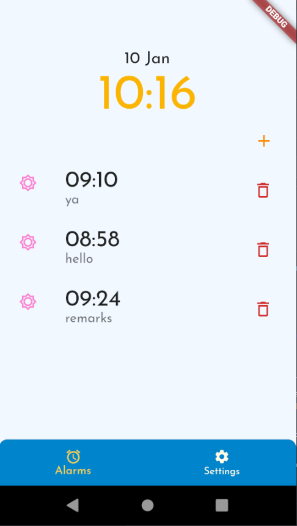
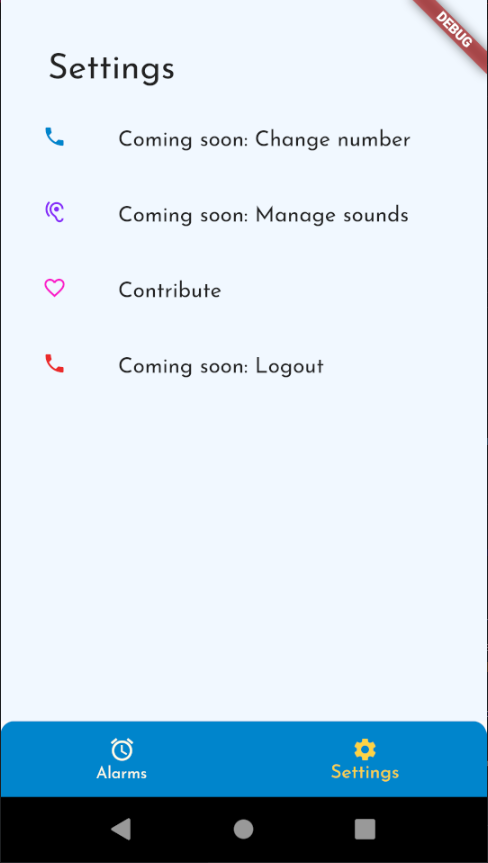

# flutter_alarm

An alarm application built with Flutter.

## Features

1. Add an alarm.

   - Fields: alarm name, alarm remarks, date and time, password

2. Delete an alarm.
3. Insistent notification

   - Device will keep vibrating and sounding off (if not on mute)
   - Upon clicking on the notification, user will be directed to a page that plays the ringing on loop until the password is entered correctly. Vibration also carries on until the password is entered correctly.

4. Edit an alarm.
5. Checks for password 'strength'. Passwords must contain at least 1 uppercase letter, 1 lowercase letter, 1 digit and 1 special character.

## Features that might be added

1. Choice of sound when alarm rings.
2. Pattern lock.
3. Alarm sharing over WiFi (i.e. sending alarms over WiFi to synced contacts).

## Note

1. Testing has only been done for Android and not iOS.
2. Lock, home and volume buttons are not locked when user lands on alarm ringing page.

Android emulator view:

## Credits
Sound file downloaded from *[freesound](https://freesound.org/s/397787/)*.

Font downloaded from *[Google](https://fonts.google.com/)*
